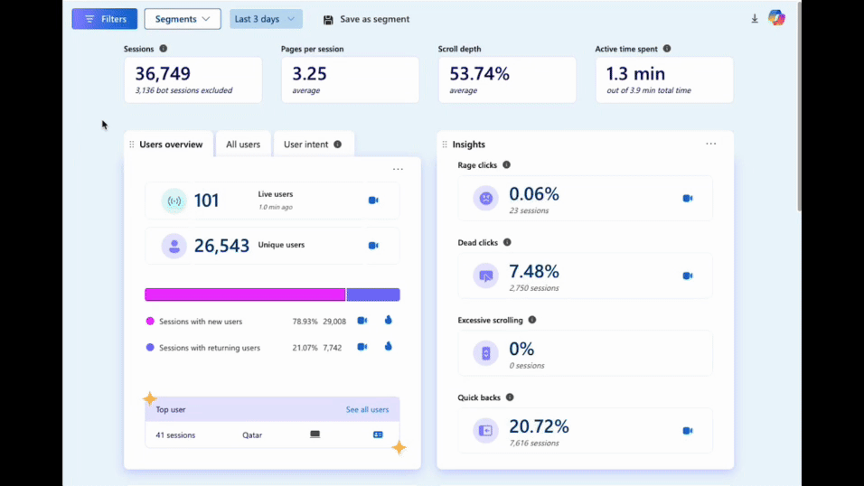

# Microsoft Clarity Debugging Utility

The **Microsoft Clarity Debugging Utility** is a web application designed to simplify the generation and management of tracking URLs for Microsoft Clarity. It will allow you to identify an individual user, or cohort of users by sending anonymized identifiers (that you can set yourself) to Microsoft Clarity.



Whilst you can use the tracking library as a standalone utility, sometimes we like to treat ourselves to use a visual interface once and a while because, as the ads say, you're worth it. Its features include customizable tracking configurations, email hashing for anonymized user identification, and session management to streamline data handling during debugging.

This project serves developers and analysts aiming to improve their debugging workflows and ensures compatibility with Clarity's tracking standards.

---

## Application Overview

### Web Interface (`app.js`)

The web interface provides tools to generate Clarity-compatible URLs and anonymized email hashes, along with utilities for session management.


You can see a deployed version of [this interface here](https://clarity-debug.netlify.app/). The UI is divided into three main functionalities:

1. **Base URL Settings**  
   Users can configure and save a base URL, which acts as the foundation for generating tracking URLs. The application validates the provided URL and stores it locally for reuse. If a base URL is not set, the application prompts users to configure it before proceeding.

2. **Generate Tracking URLs**  
   This feature creates fully-formed tracking URLs by combining the base URL with user-provided email addresses and session IDs. Emails are hashed using SHA-256 for privacy, while session IDs are validated to meet the character limit. Generated URLs include Clarity-specific query parameters, such as:

   - `neo_debug`: Activates debugging mode.
   - `neo_cuid`: Encoded user identifier.
   - `neo_csid`: Encoded session identifier.

   The resulting URLs can be copied directly to the clipboard, and users can easily edit details if needed (though, please be mindful not to PII transparently in the URL, even if Clarity says they will hash it; Google Analytics and others won't)!

3. **Email Hashing**  
   The application allows users to securely hash email addresses into anonymized identifiers. Using the browser's `crypto.subtle` API, email addresses are converted into SHA-256 hashes, encoded in Base64, and truncated for efficient use in URLs.

---

## Tracking Script (`track.js`)

This script (`track.js`), is a lightweight extension to the Microsoft Clarity library and should be loaded after this resource for greatest reliability.

Key features include:

- **Debugging Activation**  
  The script detects a `neo_debug=true` parameter in the URL to activate verbose logging. If enabled, session-specific debugging details are stored using `sessionStorage`, ensuring that the debugging state persists across the session duration.

- **Clarity Identification**  
  It automates the process of linking user and session IDs to Clarity using `clarity.identify`. This ensures that the data from the web interface integrates seamlessly with Clarity's tracking ecosystem. To prevent redundant calls, the script tracks whether identification has already been performed in the current session.

- **Session Management**  
  Session expiration is managed using timestamps in `sessionStorage`. The default expiration time is 90 minutes, which can be customized in the script's configuration.

- **Utility Functions**  
  Helper functions facilitate tasks such as retrieving query parameters, validating session timestamps, and handling errors. These functions make the script extensible and adaptable to specific debugging needs.

The script is configurable via a global `NEO_CLARITY` object, allowing developers to adjust verbosity, expiration times, and other settings.

---

## Installation and Setup

### Prerequisites

- A modern browser supporting JavaScript ES6 features and the `crypto.subtle` API.
- Microsoft Clarity integrated on the target website.

### Steps to Set Up

1. **Deploy the Application**

   - Clone or download the repository.
   - Serve the files locally or host them on a web server.
   - Open `index.html` in a browser to access the web interface.

2. **Integrate the Tracking Script**

   - Include `track.js` in your website:
     ```html
     <script
       src="https://cdn.jsdelivr.net/gh/neobadger/clarity-debugger@main/lib/track.min.js"
       defer
     ></script>
     ```
   - Configure the global `NEO_CLARITY` object (if needed):
     ```javascript
     window.NEO_CLARITY = {
       config: {
         VERBOSE_LOG: true,
         EXPIRATION_TIME_MS: 3600000, // 1 hour
       },
     };
     ```
   - Use the `neo_debug=true` query parameter to activate debugging mode when required.

3. **Generate and Use Tracking URLs**
   - Use the web interface to create tracking URLs and hash emails.
   - Embed these URLs in marketing campaigns, user invitations, or test scenarios.

---

## Debugging and Troubleshooting

### Logs and Errors

- Check the browser console for detailed logs during script execution.
- The `VERBOSE_LOG` setting in `track.js` controls the level of detail in logs.

### Common Issues

- **Clarity Not Found**: Ensure Microsoft Clarity is correctly loaded on your site.
- **Invalid URL**: Verify the format of URLs before saving them in the interface.
- **Session Expiration**: Debugging sessions expire after 90 minutes by default; adjust this in the configuration if necessary.

---

## Future Improvements

While this tool is functional and robust, there are plans for additional features, including:

- Extended analytics integration.
- Support for additional Clarity parameters and enhanced error reporting.

---

## License

This project is distributed under the MIT License. Ensure compliance with Microsoft Clarity's terms of service when using this tool.

---

This utility, developed by **NEOBADGER**, aims to simplify and enhance your debugging experience. For questions or support, feel free to contact the developer.
